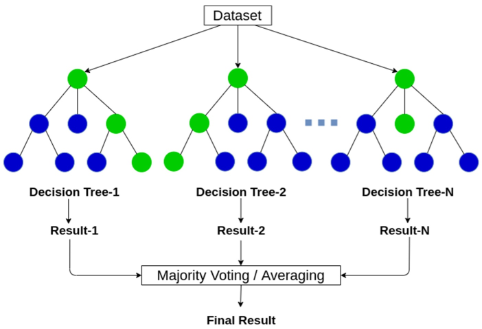
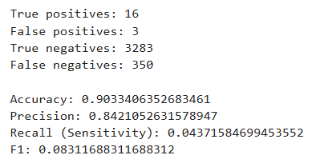
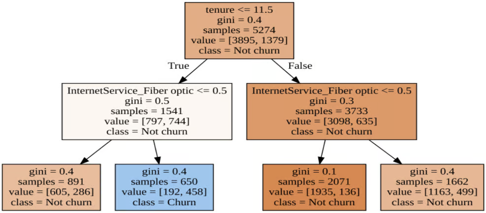
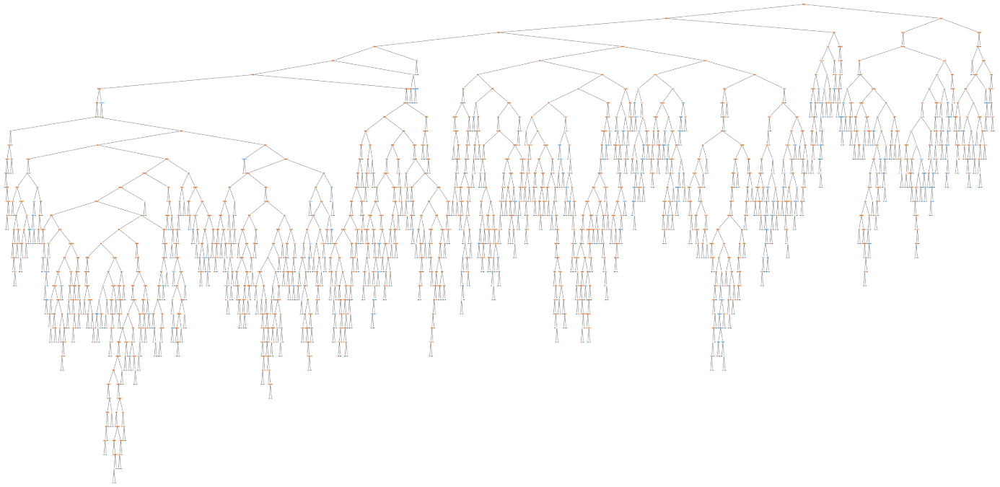
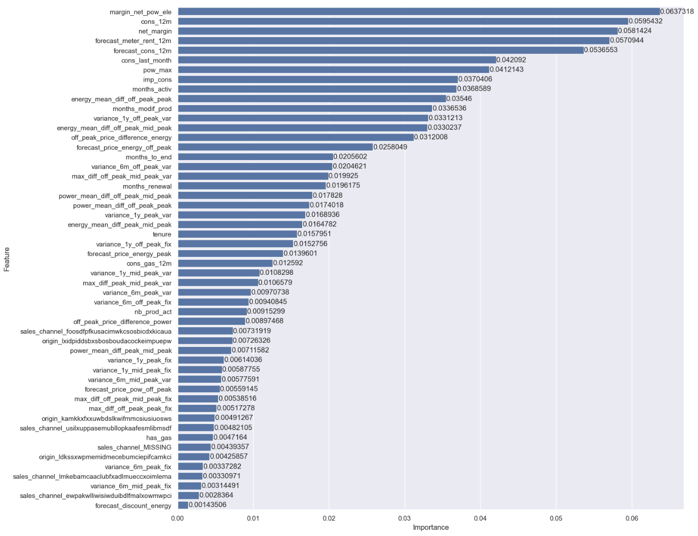

# Random Forest Model (BCG X Data Science Project Part 3)

## Introduction
This is Part 3 of a project from the [BCG X Data Science micro-internship](https://www.theforage.com/simulations/bcg/data-science-ccdz). The Boston Consulting Group (BCG) is an American global consulting firm that  partners with leaders in business and society to tackle their most important challenges. It is one of the world's 3 largest consulting firms along with McKinsey & Company and Bain & Company. BCG X is a new initiative from BCG that combines the firm's consulting expertise with tech building and design.

In this task, I take on the role of a junior data analyst employed at BCG X. BCG X's client, a major gas and electricity utility called PowerCo, is concerned about their customers leaving for better offers from other energy providers. **In this part of the project, I will create a Random Forest model using the data we have created in part 2. The Random Forest model will predict which customers will leaver PowerCo and will determine which features are the most influential in determining whether a customer will leave. We will also determine if our hypothesis, that price sensitivity is an important factor for churn, is correct.**

## Problem Statement
PowerCo has expressed concern over their customers leaving them for better offers from competing energy companies. This concern is exacerbated by the fact that the energy market has had a lot of change in recent years and there are more options than ever for customers to choose from. During a meeting with the Associate Director of the Data Science team, **one potential reason for churn is price sensitivity.** I am tasked with investigating this hypothesis. **We will use the Random Forest model to determine what features are most influential to customer churn. The data we have created in part 2 will be used as input to train and test the model.**

## Skills Demonstrated
* Python
* Machine Learning
* Random Forest
* Training and Testing Machine Learning Models
* Data Manipulation
* Data Visualization

## Data Sourcing
This original data was provided to me by the BCG X Data Science microinternship hosted by Forage. In part 2, feature engineering was conducted on the data. A copy of the altered data is included in this repository under the file name: data_for_predictions.csv.

## Data Attributes
The data contains information about power consumption, sales channels, forecasted power consumption, and whether the client has churned or not. Each row contains data for 1 client.

These attributes are included in the original data:
* id - Client company identifier.
* cons_12m - Electricity consumption of the past 12 months.
* cons_gas_12m - Gas consumption of the past 12 months.
* cons_last_month - Electricity consumption of the last month.
* forecast_cons_12m - FForecasted electricity consumption for next 12 months.
* forecast_discount_energy - Forecasted value of current discount.
* forecast_meter_rent_12m - Forecasted bill of meter rental for the next 2 months.
* forecast_price_energy_off_peak - Forecasted energy price for 1st period (off peak).
* forecast_price_energy_peak - Forecasted energy price for 2nd period (peak).
* forecast_price_pow_off_peak - Forecasted power price for 1st period (off peak).
* has_gas - Indicated if client is also a gas client.
* imp_cons - Current paid consumption.
* margin_net_pow_ele - Net margin on power subscription.
* nb_prod_act - Number of active products and services.
* net_margin - Total net margin.
* pow_max - Subscribed power.
* churn - Has the client churned over the next 3 months.

These attributes are added to the data from part 2:
* variance_1y_off_peak_var - The price variance of energy during off peak hours for 1 year.
* variance_1y_peak_var - The price variance of energy during peak hours for 1 year.
* variance_1y_mid_peak_var - The price variance of energy during mid peak hours for 1 year.
* variance_1y_off_peak_fix - The price variance of power during off peak hours for 1 year.
* variance_1y_peak_fix - The price variance of power during peak hours for 1 year.
* variance_1y_mid_peak_fix - The price variance of power during mid peak hours for 1 year.
* variance_6m_off_peak_var - The price variance of energy during off peak hours for the last 6 months of the year.
* variance_6m_peak_var - The price variance of energy during peak hours for the last 6 months of the year.
* variance_6m_mid_peak_var - The price variance of energy during mid peak hours for the last 6 months of the year.
* variance_6m_off_peak_fix - The price variance of power during off peak hours for the last 6 months of the year.
* variance_6m_peak_fix - The price variance of power during peak hours for the last 6 months of the year.
* variance_6m_mid_peak_fix - The price variance of power during mid peak hours for the last 6 months of the year.
* off_peak_price_difference_energy - The price difference of energy during off peak hours from the beginning of the year to the end of the year.
* off_peak_price_difference_power - The price difference of power during off peak hours from the beginning of the year to the end of the year.
* energy_mean_diff_off_peak_peak - The average difference in energy price between off peak and peak hours.
* energy_mean_diff_peak_mid_peak - The average difference in energy price between peak and mid peak hours.
* energy_mean_diff_off_peak_mid_peak - The average difference in energy price between off peak and mid peak hours.
* power_mean_diff_off_peak_peak - The average difference in power price between off peak and peak hours.
* power_mean_diff_peak_mid_peak - The average difference in power price between peak and mid peak hours.
* power_mean_diff_off_peak_mid_peak - The average difference in power price between off peak and mid peak hours.
* max_diff_peak_mid_peak_var - The greatest difference in energy price between peak and mid peak hours
*	max_diff_off_peak_mid_peak_var - The greatest difference in energy price between off peak and mid peak hours.
* max_diff_peak_mid_peak_fix - The greatest difference in power price between peak and mid peak hours
*	max_diff_off_peak_mid_peak_fix - The greatest difference in power price between off peak and mid peak hours.
* months_activ - Number of months the contract is activated.
* months_to_end - Number of months until the end of the contract.
* months_modif_prod - Number of months since the last modification of the contract.
* months_renewal - Number of months until the next renewal.
* tenure - The number of years a customer has been in business with PowerCo.
* sales_channel_MISSING - Dummy variable representing a sales channel.
* sales_channel_ewpakwlliwisiwduibdlfmalxowmwpci - Dummy variable representing a sales channel.
* sales_channel_foosdfpfkusacimwkcsosbicdxkicaua - Dummy variable representing a sales channel.
* sales_channel_lmkebamcaaclubfxadlmueccxoimlema - Dummy variable representing a sales channel.
* sales_channel_usilxuppasemubllopkaafesmlibmsdf - Dummy variable representing a sales channel.
* origin_kamkkxfxxuwbdslkwifmmcsiusiuosws - Dummy variable representing the electricity campaign the customer first subscribed to.
* origin_ldkssxwpmemidmecebumciepifcamkci - Dummy variable representing the electricity campaign the customer first subscribed to.
* origin_lxidpiddsbxsbosboudacockeimpuepw - Dummy variable representing the electricity campaign the customer first subscribed to.

## Data Modelling
**Data modeling is the process of converting raw data into insight using algorithms and other systems of equations.** The machine learning model that we will use to predict churn is the Random Forest model. The Random Forest model is an algorithm that combines the output of multiple decision trees to reach a single decision.

A copy of this data modelling project is included in this repository under the file name: James Weber Random Forest Model.ipynb.

### 1. Importing Libraries and Data
We must first import libraries which contains the commands we need to create a Random Forest model.
Then we import the data from the data_for_predictions.csv file into the df dataframe. The data_for_predictions.csv file is the final output from part 2 of this project. It is a modified version of the client data with 34 features added to it in order to improve the Random Forest model's predictive ability.
```
# Import libraries.

import warnings
warnings.filterwarnings("ignore", category=FutureWarning)

import pandas as pd
import numpy as np
import seaborn as sns
from datetime import datetime
import matplotlib.pyplot as plt

%matplotlib inline

sns.set(color_codes = True)

from sklearn import metrics
from sklearn.model_selection import train_test_split
from sklearn.ensemble import RandomForestClassifier
from sklearn.model_selection import GridSearchCV
from sklearn.tree import plot_tree

# Use the read_csv() command to import .csv files.
# Create a client_df dataframe for the client data and a price_df dataframe for the price data.

df = pd.read_csv(r'C:/Users/jwebe/OneDrive/Desktop/data_for_predictions.csv')
```

### 2. Data Sampling
**Random Forest model is a supervised learning algorithm. Supervised learning algorithms requires training data to create the model.** Once the model is created using the training data, the model is compared with the test data to determine if the model is overfitting, underfitting, or has good fit.

**The first thing we need to do is to split our dataset into training and test data.** Since both training and test data come from the same dataset, they should follow the same pattern even if the data in both sets are different. **By creating a model using the training data and testing the model using the test data, we can determine how well the model can predict the pattern within the data.**

**Depedent variables are variables that we are trying to predict.** In this case, the dependent variable is churn. **Independent variables are the variables used to predict the dependent variables.** The independent variables are the other variables except churn. **Both training and test variables need to be separated into independent and dependent variables.**

The code below will first separate the data into dependent and independent data. Then it will take random sample of 25% of the data and assign it as test data. The remaining data will be assigned as training data.
```
# Make a copy of the data.
# It's a good idea to keep the original data intact in case you need the data in the original dataframe.
# Use the .copy() command to create a copy of the data.

train_df = df.copy()

# Separate target variable from independent variables.
# The target variable is the variable you are trying to predict (churn).
# The independant variables are the varibales you will use to predict the target variable (all variables except churn and id).

y = df['churn']
X = df.drop(columns=['id', 
                     'churn'])

# Create training and test data.
# The test_size the is % of the original data that will be used for test data.
# A typical % for test data is 20%-30%. We will use 25%.

X_train, X_test, y_train, y_test = train_test_split(X, 
                                                    y, 
                                                    test_size = 0.25, 
                                                    random_state = 42)
```
### 3. Training the Model
**To train the model, we need to create a Random Forest model using the training data.** The model will use the training data, create decision trees, and will **predict whether a customer will churn or not by finding and learning patterns within the training data.**

The code below will create a Random Forest model using the training data.
```
# Use the RandomForestClassifier() command to create a random forest model.

model = RandomForestClassifier(n_estimators = 1000, 
                               random_state = 42)

# Use the .fit() command to fit the data into the model.
# The data that we will fit into the model will be the training data, both x_train and y_train.

fitted = model.fit(X_train, y_train)
```

### 4. Model Testing
Now that we trained the Random Forest model, we will use the test data to test the model. **We test the model by using the test data as inputs for the Random Forest model. We will then use a confusion matrix to determine the accuracy, precision, and recall for the model.**

The code below will take the Random Forest model we created and use the test data as input. It will then create a confusion matrix to determine how accurate the model is.
```
# Use the .predict() command to labels of the data values on the basis of the trained model.
# Use the test data (X_test) as input.

predictions = fitted.predict(X_test)

# Use the metrics.confusion() command to compute confusion matrix to evaluate the accuracy of a classification.
# Use the y_test variable as the true values.
# Use predictions as the predicted values.
# Use the .ravel() command to merge multiple arrays (tn, fp, fn, tp) to a single array.

tn, fp, fn, tp = metrics.confusion_matrix(y_test, predictions).ravel()

## Use the print() command to print out the results of the confusion matrix.

print(f"True positives: {tp}")
print(f"False positives: {fp}")
print(f"True negatives: {tn}")
print(f"False negatives: {fn}\n")

print(f"Accuracy: {metrics.accuracy_score(y_test, predictions)}")
print(f"Precision: {metrics.precision_score(y_test, predictions)}")
print(f"Recall (Sensitivity): {metrics.recall_score(y_test, predictions)}")
print(f"F1: {metrics.f1_score(y_test, predictions)}")
```


The above picture depicts the results of the confusion matrix.

**True Positives (TP) are events where the model predicted a positive value (a customer will churn) and the data supports the model's prediction. False Positives (FP) are events where the model predicts a positive value but the data does not support the prediction.**

**Similarly, True Negatives (TN) are events where the model predicts a negative value (a cusotmer will not churn) and the data supports the prediction. False Negatives (FN) are events where the model predicts a negative value but the data does noot support the prediction.**

**Accuracy is the overall accuracy of the model.** It is calculated as TP + TN/TP + TN + FP + FN where TP + TN represents all the predictions that are correct and TP + TN + FP + FN represents all of the predictions.

**Precision is the ability of the model to accurately predict positive values.** It is calculated as TP/TP + FP where TP represents  the values that the model correctly predicts will have a positive value and TP + FP represents all the values that the model predicts will have a positive value, regardless of whether it is correct or incorrect.

**Recall is the ability of the model to accurately detect positive values.** It is calculated as TP/TP + FN where TP represents  the values that the model correctly predicts will have a positive value and TP + FN represents the actual number of positive values.

**F1 represents how well the model can detect and accurately predict positive values.** It is calculated as 2 * (Precision * Recall)/(Precision + Recall).

**Our model has a high accuracy score of 90.33%. If the model predicts that a value will be positive (yes, a customer will churn) or negative (no, a customer will not churn), there is a 90.33% chance that the prediction is accurate.**

**Our model also has a high precision score of 84.21%.** Accuracy represents how well the model is able to predict both positive and negative values, while precision represents how well the model is able to predict positive values. The model has predicted 19 positive values and 16 of the predicted values are true. **This indicates that if the model predicts that a value is positive, there is a 84.21% chance that prediction is accurate.**

**However, our model has a very low recall score of 4.37%.** Recall represents how well the model can detect positive values. There are a total of 366 values that are positive and the model was able to accurately predict 16 of them. **This means that our model can only detect 4.37% of positive values.**

**Our model also has a very low F1 score.** The F1 score represents how accurate the model is at predicting and detecting positive and negative values. **A low F1 score indicated that either precision or recall is significantly lower than the other. Because the model has a high precision score and a low recall score, our F1 score is also low.**

**A model with high precision and low recall means that our model is more cautious in its predictions. While it may miss a substantial number of customers who will churn, it will be confident in its predictions when it deos predict that a customer will churn.**

### 5. Decision Tree Visualization
**A Decision Tree is a machine learning model that takes the training data and splits the data into different nodes by using if then else conditions.** The subsection of training data that meets the condition will be placed in one node and the rest of the data will be placed in a different node. Each node is further split in the same way until all the data points in a node has the same value. In our case, the decision tree will stop splitting a node if all the data points in the node has a churn value of 1 or 0.

The picture below is an example of a decision tree.



When test data or future data is inputted into a Decision Tree, each data point starts at the top. Based on whether or not that data point meets the condition, it will take one of 2 paths downward. This continues until all data points reach the bottom, where they will be classified as "Churn" or "Not Churn".

**Although a Decision Tree is an effective way to classify data, it is prone to overfitting. Overfitting occurs when a model performs well on the training data but poorly on new, unseen test data. It fits the training data too closely that it fails on the test data or future data.**

**The Random Forest model minimizes overfitting by using multiple randomly created Decision Trees.** Unlike Decision Trees which use all data points and all features in the training data, the Random Forest model creates multiple Decision Trees using randomly selected data points and features in the training data. Each Decision Tree created in a Random Forest model is created using a different set of randomly chosen data points and features. **The Random Forest model we created in this project created 1000 randomly created Decision Trees.**

**When test data or future data is inputted into a Random Forest Model, each data point goes through all Decision Trees made by the model. Each individual Decision Tree will classify the data points as "Churn" or "Not Churn". The Random Forest model will classify a data point by taking the most popular result.**

The code below will create a visualization of one of the Decision Trees created from our Random Forest model.
```
# Use the plot_tree() command to plot a decision tree.
# model.estimators[] is the tree you want to plot.
# feature_names is the name of the variables used to predict the independant variable.
# class_names is the name of the target classes.
# filled colors the nodes.

plt.figure(figsize=(80,40))
plot_tree(model.estimators_[0], feature_names = X.columns, class_names = ['Churn', "No Churn"],filled = True);
plt.show()
```


The start of the tree is located in the upper right. Although the Decision Tree uses a subset of training data and features, it is still a very large and extensive tree.

### 6. Feature Importance
**Feature importance is an indication of how important a feature is within a predictive model. Feature importance represents the number of times a feature is used to create conditional splits within all the Decision Trees created by the Random Forest model.**

The code below is used to create a bar chart that depicts feature importance.
```
# Find the most important features that determine churn.
# Use the .feature_importances_ command to find the importance values of each feature.

fitted.feature_importances_

#Create an importance dataframe that displays the features and importance level.

feature_importance = pd.DataFrame({'Feature': X_train.columns, 
                                   'Importance': fitted.feature_importances_})

feature_importance.sort_values(by = 'Importance', 
                               ascending = False, 
                               inplace = True)

# Use the fig, ax = plt.subplots() command to create a set of subplots within one cell.
fig, ax = plt.subplots(1, 1, figsize=(15, 15))

# Use the sns.barplot() command to create a bar plot.

sns.barplot(data = feature_importance, 
            x = 'Importance', 
            y = 'Feature')

ax.bar_label(ax.containers[0])

plt.show()
```


Based on the char above:
* The greatest driver for churn is the net margin on power subscription (0.064), followed by electricity consumption of the past 12 months (0.06), and total net margin (0.058).
* Time is also an influential factor, such as the number of months a customer has been active (0.037), their tenure (0.016), and the number of months since they renewed their contract (0.02).
* Features that are influential to churn tend to fall under power consumption and time.
* Price senitivity features (variance in prices, max difference in price) are scattered. Some price sensitivity features have a higher influence on churn, such as the price variance between off peak and peak time. Most sensitiviy features, however, have very low influence on churn.
* **This would suggest that our original hypothesis, that price senitivity is the main contributor for churn, is incorrect.**

## Conclusion and Recommendations
**The goal of the project is to analyze PowerCo's client and price data and determine potential causes for customer churn. One hypothesis for customer churn is price sensitiviy.** We have conducted exploratory data analysis on the data, used feature engineering to alter and create new features in the data, and created a Random Forest model to predict which customers will churn and determine which features have the most influence on customer churn.

We have found that:
* Our model has high accuracy and precision, but low recall. This means that when the model makes a prediction, there is a high probability that the model is correct. However, it has difficulty identifying customers who will churn.
* Features with the most influence on customer churn are related to power consumption and time. This includes features such as net margin on power subscription, electricity consumption of the past 12 months, total net margin, number of months a customer has been active, tenure, and the number of months since they renewed their contract.
* Price sensitivity is not a leading cause of churn. Price sensitiviy features are scattered with many have very low influence on churn.

Recommdenations:
* Since feature importance is based on our Random Forest model, we should rework the model to improve the recall score. This may include working more on feature analysis or adjusting the parameters of the model.
* Focus on retaining newer customers or customers with tenure less than 8 years.
* Add benefits or saving for customers with higher power consumption. For example, customers with a certain level of electricity consumption will have a discounted price for electricty for the next 6 months. 
